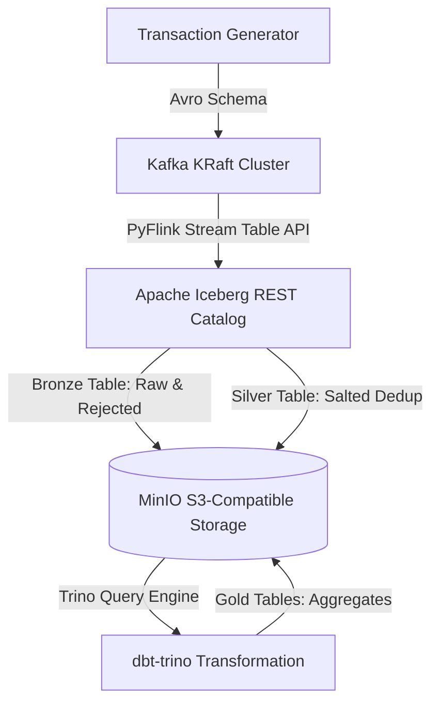

# Fintech Real-Time Medallion Lakehouse (AI-Augmented Architectural Research)

## Project Statement & Origin (Honest Disclosure)
This repository is an **AI-augmented educational research project** designed, orchestrated, and maintained by a rising Year 2 computer engineering/science student. 

The primary goal of this project was to explore the boundaries of modern Large Language Models (LLMs) by chaining prompts to scaffold a highly complex, enterprise-grade real-time data platform. The resulting codebase serves as a personal active sandbox for learning and studying distributed systems engineering, stream processing, catalog-level data storage, and query optimization.

While the physical code, configurations, and test suites were generated using AI-agent pipelines, the architectural decisions, pipeline topologies, security compliance standards, and integration choices were manually driven and verified.

---

## Technical Stack & Architecture

This platform implements a real-time Medallion Architecture (Bronze, Silver, and Gold) processing financial transactions under strict security and data integrity constraints.



### 1. Ingestion & Messaging
* **Kafka KRaft Cluster:** A 3-broker local cluster configured with `KAFKA_MIN_INSYNC_REPLICAS: 2` and `KAFKA_TRANSACTION_STATE_LOG_MIN_ISR: 2` to guarantee high availability and prevent data loss.
* **Confluent Schema Registry:** Enforces `BACKWARD_TRANSITIVE` schema compatibility on the transaction topic before data can be produced.
* **Transaction Simulator:** Generates mock transaction payloads matching the Avro schema contract.

### 2. Stream Processing (PyFlink)
* **Bronze Ingestion:** Reads Avro-serialized data from Kafka and splits events into valid transactions (`bronze.transactions`) and invalid transactions (`bronze.transactions_rejected`) based on data contract integrity.
* **Stateful Deduplication (Silver):** Uses an event-time **Tumbling Window (TUMBLE)** with `MIN` aggregation inside a PyFlink statement set to deduplicate transactions. This approach keeps state memory bounded, avoiding the massive RocksDB growth associated with naive `ROW_NUMBER() OVER (...)` deduplication.
* **PII Masking:** Uses a salted SHA-256 algorithm implemented in Flink SQL to securely mask critical fields (`account_id` and `device_id`) before writing to the Silver layer.
* **RocksDB State Backend:** Configured with incremental checkpointing (`state.backend.incremental: true`) and managed memory pool limits to prevent off-heap memory leaks.

### 3. Catalog & Lakehouse Storage (Apache Iceberg & MinIO)
* **REST Catalog:** Powered by an Iceberg REST Catalog server backed by a PostgreSQL database for transaction logging and snapshot management.
* **Storage Layer:** MinIO (S3-compatible object storage) running Iceberg v2 table formats using ZSTD compressed Parquet files.
* **Hashed File Path Layout:** Employs Iceberg's `object_store_layout_enabled = true` configuration to prevent S3 prefix bottlenecking and ensure high-throughput reads/writes.
* **Table Maintenance:** A dedicated maintenance worker script runs periodic `optimize` (data file compaction) and `optimize_manifests` operations to eliminate the "small file problem" caused by frequent Flink checkpoints.

### 4. Query & Analytics (Trino & dbt)
* **Trino Query Engine:** Serves as the query layer, enabling fast, SQL-compliant analytical queries directly over the Iceberg catalog.
* **dbt-trino (Gold Layer):** Builds aggregated analytical models (e.g., fraud alerts, hourly liquidity pools) utilizing partition pruning macros to maximize query efficiency.

---

## Key Architectural Learnings & Deep Dives

Driving the AI to build this repository facilitated hands-on learning of advanced data platform concepts:

1. **State TTL & Checkpoint Timeout Coordination:** Learned how RocksDB state retention times (State TTL) must be aligned with Flink checkpoint intervals and recovery buffers to prevent silent duplicate row injection after a TaskManager recovery.
2. **Schema Evolution Handling:** Analyzed the risks of nullable-field schema drift and how Flink's Confluent Avro deserializer maps to Flink SQL types.
3. **Optimistic Concurrency Control (OCC):** Studied how Iceberg handles concurrent writes (Flink streaming writes vs. Trino compaction queries) using retries without locking database tables.
4. **Programmatic Config Testing:** Explored writing Python tests that parse `docker-compose.yml` to assert correct environment injection, network configurations, and container startup sequences.

---

## How to Run & Explore

### Prerequisites
* Docker & Docker Compose
* Python 3.10+

### Setup & Startup
1. **Clone the repository and create the environment file:**
   ```bash
   cp .env.example .env
   # Update PII_HASH_SALT with a secure 32+ hex character string
   ```
2. **Start the infrastructure stack:**
   ```bash
   docker compose up -d
   ```
3. **Initialize the Iceberg Catalog & Tables:**
   ```bash
   docker compose run --rm iceberg-init
   ```
4. **Run the PyFlink Streaming Job:**
   ```bash
   docker compose exec flink-jobmanager flink run -py /opt/streaming/jobs/kafka_to_iceberg.py -d
   ```
5. **Start the Transaction Simulator:**
   ```bash
   python simulator/main_generator.py
   ```
6. **Trigger dbt Transformations:**
   ```bash
   docker compose run --rm dbt-runner run
   ```

---

## Research & Verification Notes
A comprehensive security and reliability re-audit report was generated to identify edge cases, distributed race conditions, and schema evolution vulnerabilities. The full audit findings and remediation suggestions can be reviewed in the audit log: [security_audit_report.md](file:///C:/Users/Brightpmk/.gemini/antigravity-ide/brain/f1c647e5-7106-4eeb-ab6f-77409cffe609/security_audit_report.md).
